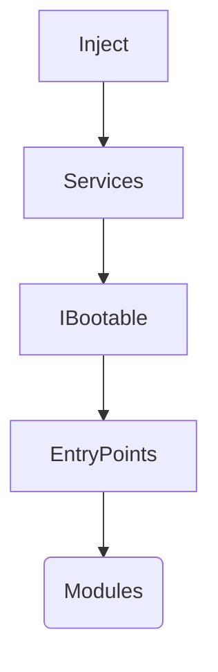

# Тестовое задание KB Production

---

## 🛠️ Стек 

-   Unity 6000.0.34f1
-   UniTask
-   VContainer
-   UniRx
-   DoTween

---

## 🚀 Entry point

1.  Bootstrap scene
2.  Play!

---

## 🏗️ Архитектура

### Порядок инициализации

### Сервисы 1го порядка
-  сервисы не имеющие зависимостей

### Сервисы 2го порядка
-  сервисы имеющие зависимости от сервисов 1го порядка (например AppMetricaService зависит от SaveService и должен быть инициализирован строго позже)

### Inject
-  за DI отвечает VContainer
-  все сервисы по возможности создаются используя ScriptableInstaller, который позволяет создать SO с необходимыми ресурсами
-  инсталлеры собираются в CompositInstaller для разделоения по контейнерам

### Управляющая логика
- Логика управления состояниями приложения реализуется в EntryPoints наследованых от ABaseEntryPoint (в данном случае единственная точка входа BootstrapEntryPoint)
- Логика управления игровыми циклами (сесиями, режимами) реализуется в соответствующих сервисах (в данном случае в единственном сервисе MainGameService)

### Игровой процесс
- В процессе игры существует один сервис (MainGameService) который обеспечивает работу модулей (ABaseModule : IGameModule)
- Каждый модуль отвечает за свою механику, опираясь на общие для процесса данные (которые хранятся в сервисах)
- модули доставляются посредсвам иньекции зависимостей и могут быть разделены на контейнеры (также возможен вариант доставки без иньекции, поскольку обращение к модулям необходимо только из одного сервиса)
- модули реализуют методы OnStart, OnUpdate и OnEnd, а также событие OnEndCycle на случай если механика может прервать игру или перезапустить ее
